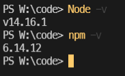
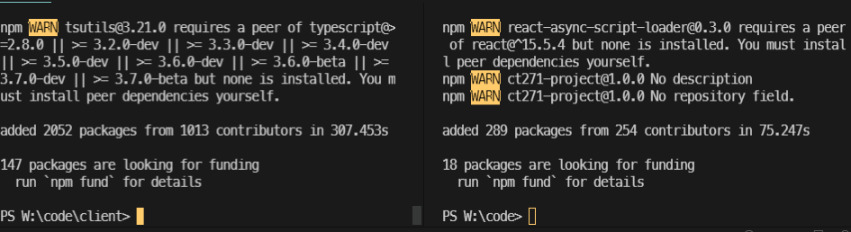
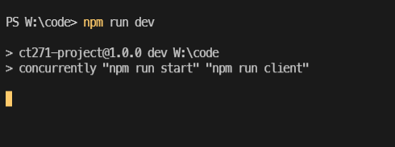
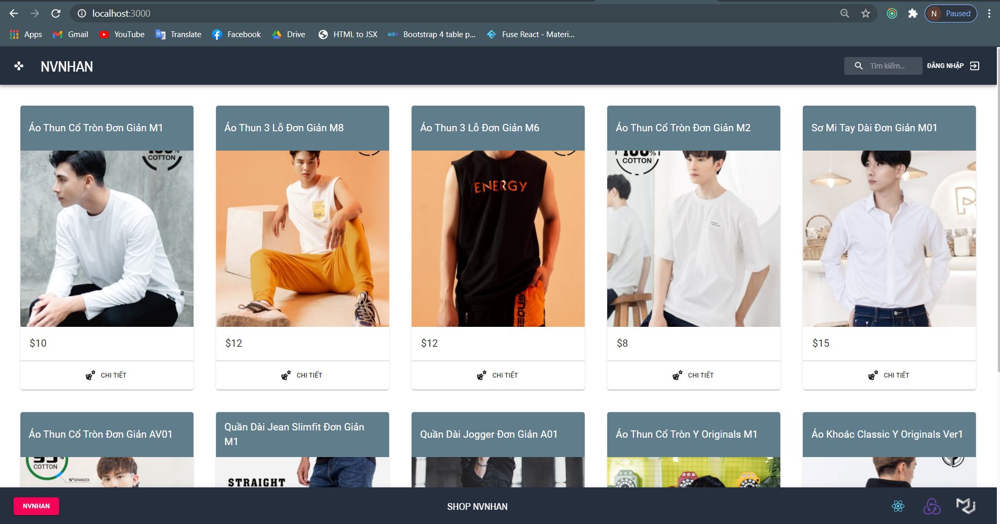
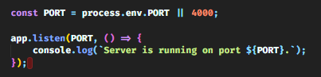
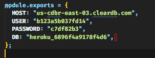
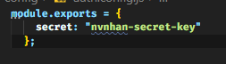

# Tài liệu hướng dẫn cài đặt
1. Install NodeJS
[https://nodejs.org/en/download/](https://nodejs.org/en/download/)
<div>
    
</div>

2. Directory  ```code``` 
   ```yarn``` or ```npm install```
3. cd ```client```
   ```yarn``` or ```npm install```
   <div>
    
</div>

4. Dicrectory ```code```
   ```npm run dev``` or ```yarn run dev```

 <div>
    
</div>

5. result

     <div>
    
    </div>

6. config server
   config port: ```server.js```

   <div>
    
    </div>
    
    config database: ```/code/app/config/db.config.js```

    <div>
    
    </div>

     config secret-key: ```/code/app/config/auth.config.js```

      <div>
    
    </div>
